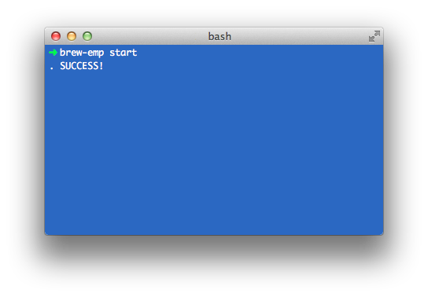

# Homebrew (E)Nginx MySQL PHP Installer

Native way to setup web environment for Mac.

## Overview

This script will install and setup **Nginx** + **MySQL** + **PHP** through **Homebrew**.

## Requirements

* [Homebrew](http://mxcl.github.com/homebrew/)
 
## Installation
`curl -L https://raw.github.com/mrded/brew-emp/master/tools/install.sh | bash`

## Uninstall
`curl -L https://raw.github.com/mrded/brew-emp/master/tools/uninstall.sh | bash`

## Update PHP version
`curl -L https://raw.github.com/mrded/brew-emp/master/tools/update.sh | bash`

## Usage
`brew-emp [start | stop | restart]`

## Creating VirtualHost
For example let's create virtual host for Drupal 'mysite'.

Copy Drupal preset:
`cp /usr/local/etc/nginx/sites-available/drupal.local /usr/local/etc/nginx/sites-available/mysite.local`
    
Change name and path to site: 
`vim /usr/local/etc/nginx/sites-available/mysite.local`
    
    
    server {
      listen       80;
      server_name  mysite.local;
      root /Users/mrded/Sites/mysite;

      access_log /usr/local/var/log/nginx/mysite.access.log;
      error_log  /usr/local/var/log/nginx/mysite.error.log;

      include /usr/local/etc/nginx/common/drupal;
    }

Enable virtual host:
`ln -s /usr/local/etc/nginx/sites-available/mysite.local /usr/local/etc/nginx/sites-enabled/mysite.local`

Add `127.0.0.1 mysite.local` to `/etc/hosts`.

## Default Settings

### MySQL
Username: root

Password:

Port: 3306

### Xdebug
Remote port is 9002

## Configs

**Nginx**: `/usr/local/etc/nginx/nginx.conf`

**FastCGI**: `/usr/local/etc/nginx/fastcgi.conf`

**PHP**: `/usr/local/etc/php/5.6/php.ini`

**Redis**: `/usr/local/etc/redis.conf`

**Xdebug**: `/usr/local/etc/php/5.6/conf.d/ext-xdebug.ini`

**MySQL**: `/usr/local/etc/my.cnf`

### Handy projects
* [launchrocket](https://github.com/jimbojsb/launchrocket) - a PrefPane to manage all your Homebrew-installed services.
* [Hosts.prefpane](https://github.com/specialunderwear/Hosts.prefpane) - a PrefPane to manage /etc/hosts
